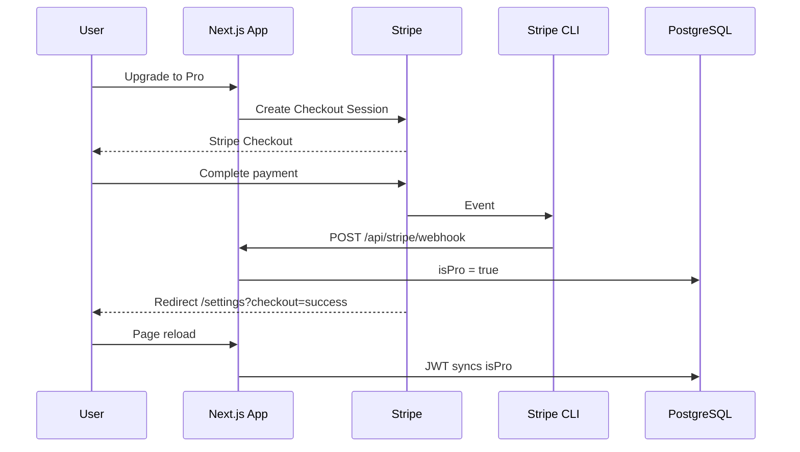

# Stripe Integration — Phase 2: Integration & UI

## Overview

Phase 2 completes the Stripe subscription flow: webhooks that sync `isPro`, free-tier enforcement in server actions, billing/upgrade UI, and end-to-end testing with the Stripe CLI.

Depends on Phase 1 (`@context/features/stripe-phase-1-spec.md`).

## Goals

- Process Stripe webhook events and update `isPro` in the database
- Enforce free-tier limits (50 items, 3 collections) in server actions
- Add billing settings, upgrade prompts, and usage display across the app
- Cancel Stripe subscription on account deletion
- Verify full checkout → webhook → Pro unlock flow using Stripe CLI

## Prerequisites

- Phase 1 complete (Stripe client, checkout/portal routes, JWT `isPro` sync, usage-limits module)
- [Stripe CLI](https://stripe.com/docs/stripe-cli) installed
- Stripe Dashboard configured:
  - **iPocket Pro** product with $8/mo and $72/yr prices
  - Customer Portal enabled (cancel, switch plans, update payment method)
  - Webhook endpoint for production (local dev uses CLI forwarding)

## Requirements

### 1. Webhook Handlers — `src/lib/stripe/webhook-handlers.ts`

| Handler | Event | Database update |
|---------|-------|-----------------|
| `handleCheckoutCompleted` | `checkout.session.completed` | `isPro: true`, set `stripeCustomerId`, `stripeSubscriptionId` |
| `handleSubscriptionUpdated` | `customer.subscription.updated` | `isPro` = `true` when status is `active` or `trialing`, else `false`; update `stripeSubscriptionId` |
| `handleSubscriptionDeleted` | `customer.subscription.deleted` | `isPro: false`, `stripeSubscriptionId: null` |

- Resolve user via `metadata.userId` on session/subscription
- No-op gracefully when `userId` metadata is missing
- Handlers must be idempotent (duplicate events should not error)

### 2. Webhook API Route — `src/app/api/stripe/webhook/route.ts`

`POST /api/stripe/webhook`

- No session auth — verify `stripe-signature` header
- Read raw body via `request.text()` (required for signature verification)
- Return 400 on missing/invalid signature
- Return 500 if `STRIPE_WEBHOOK_SECRET` is not configured
- Dispatch to handlers for the three events above
- Return `{ received: true }` on success
- Add `export const runtime = "nodejs"` if Stripe SDK requires Node.js runtime

### 3. Webhook Handler Tests — `src/lib/stripe/webhook-handlers.test.ts`

Mock Prisma. Cover:

- `handleCheckoutCompleted` sets `isPro`, customer ID, subscription ID
- `handleCheckoutCompleted` no-ops when `metadata.userId` is missing
- `handleSubscriptionUpdated` sets `isPro: true` for `active` and `trialing`
- `handleSubscriptionUpdated` sets `isPro: false` for `past_due`, `canceled`, etc.
- `handleSubscriptionDeleted` sets `isPro: false` and clears `stripeSubscriptionId`

### 4. Feature Gating — Server Actions

Use `src/lib/subscription-limits.ts` from Phase 1.

#### `src/actions/items.ts` — `createItem`

Before creating an item:

1. Load `isPro` via `getUserIsPro`
2. If not Pro, check `getUserItemStats().itemCount >= FREE_ITEM_LIMIT`
3. Return `{ success: false, error: "Free plan is limited to 50 items. Upgrade to Pro for unlimited items." }`
4. Reuse the same `isPro` variable for existing file-type Pro check

#### `src/actions/collections.ts` — `createCollection`

Before creating a collection:

1. Load `isPro` via `getUserIsPro`
2. If not Pro, check `getUserItemStats().collectionCount >= FREE_COLLECTION_LIMIT`
3. Return `{ success: false, error: "Free plan is limited to 3 collections. Upgrade to Pro for unlimited collections." }`

#### Action Tests

Extend `src/actions/items.test.ts` and `src/actions/collections.test.ts`:

- Free user at item limit → `createItem` fails with limit error
- Free user below item limit → `createItem` succeeds
- Pro user at 50+ items → `createItem` succeeds
- Free user at collection limit → `createCollection` fails
- Free user below collection limit → `createCollection` succeeds
- Existing file-upload Pro gating still works

### 5. Settings Billing — `src/components/settings/billing-card.tsx`

Client component. Props from server:

- `isPro`, `stripeCustomerId`, `itemCount`, `collectionCount`

Behavior:

- **Free users:** plan badge, usage summary (`X / 50` items, `X / 3` collections), monthly/yearly toggle, "Upgrade to Pro" button
- **Pro users:** plan badge, "Manage subscription" button → portal API
- Upgrade: `POST /api/stripe/checkout` → redirect to returned URL
- Manage: `POST /api/stripe/portal` → redirect to returned URL
- Toast on `?checkout=success` and `?checkout=cancelled` query params (use `sonner`)

#### `src/lib/db/settings.ts`

Extend `SettingsData`:

```typescript
user: { email, hasPassword, isPro, stripeCustomerId }
usage: { itemCount, collectionCount }
```

#### `src/app/settings/page.tsx`

Render `<BillingCard />` above or between existing cards.

### 6. Upgrade Prompt — `src/components/shared/upgrade-prompt.tsx`

Reusable dialog for limit-hit scenarios:

```typescript
type UpgradePromptProps = {
  open: boolean;
  onOpenChange: (open: boolean) => void;
  reason: "item_limit" | "collection_limit" | "file_upload" | "general";
};
```

- Contextual message per `reason`
- CTA triggers checkout (monthly default) or links to `/settings`

Wire into:

- `src/components/items/item-create-dialog.tsx` — accept `itemCount` prop; show prompt at limit
- `src/components/collections/collection-create-dialog.tsx` — accept `collectionCount` prop; show prompt at limit
- Pass counts from parent components that already have stats or `isPro`

### 7. Profile Usage Display

#### `src/components/profile/usage-statistics-card.tsx`

- Accept `isPro` prop
- Free users: show `count / 50` and `count / 3` with limit labels
- Pro users: show counts only (no limit denominator)

#### `src/app/profile/page.tsx`

Pass `isPro` from `getProfileData()` to usage card.

### 8. Upgrade Entry Points

| Location | Change |
|----------|--------|
| `src/components/dashboard/sidebar-user-menu.tsx` | "Upgrade to Pro" menu item when `!user.isPro` → `/settings` |
| `src/components/marketing/homepage-pricing.tsx` | Logged-out → `/register`; logged-in free user → checkout |
| `src/components/dashboard/top-bar.tsx` | Pass `itemCount` to `ItemCreateDialog` if needed for limit UX |

### 9. Account Deletion — `src/app/api/auth/account/route.ts`

Before `prisma.user.delete`:

- If `stripeSubscriptionId` is set, call `getStripe().subscriptions.cancel(id)`
- Proceed with user deletion even if Stripe cancel fails (log error)

## Files to Create

| File | Description |
|------|-------------|
| `src/lib/stripe/webhook-handlers.ts` | Event handler functions |
| `src/lib/stripe/webhook-handlers.test.ts` | Handler unit tests |
| `src/app/api/stripe/webhook/route.ts` | Webhook endpoint |
| `src/components/settings/billing-card.tsx` | Settings billing UI |
| `src/components/shared/upgrade-prompt.tsx` | Reusable upgrade dialog |

## Files to Modify

| File | Change |
|------|--------|
| `src/actions/items.ts` | Free-tier item limit enforcement |
| `src/actions/collections.ts` | Free-tier collection limit enforcement |
| `src/actions/items.test.ts` | Limit enforcement tests |
| `src/actions/collections.test.ts` | Limit enforcement tests |
| `src/lib/db/settings.ts` | Billing + usage fields |
| `src/app/settings/page.tsx` | Add `BillingCard` |
| `src/components/profile/usage-statistics-card.tsx` | Limit display for free users |
| `src/app/profile/page.tsx` | Pass `isPro` to usage card |
| `src/components/items/item-create-dialog.tsx` | Limit UX + upgrade prompt |
| `src/components/collections/collection-create-dialog.tsx` | Limit UX + upgrade prompt |
| `src/components/dashboard/sidebar-user-menu.tsx` | Upgrade menu item |
| `src/components/marketing/homepage-pricing.tsx` | Logged-in checkout CTA |
| `src/app/api/auth/account/route.ts` | Cancel subscription on delete |

## Stripe CLI Setup (Required for Phase 2 Testing)

### 1. Forward webhooks locally

```bash
stripe listen --forward-to localhost:3000/api/stripe/webhook
```

Copy the CLI-generated webhook signing secret into `.env` as `STRIPE_WEBHOOK_SECRET`.

### 2. Start dev server

```bash
npm run dev
```

Keep both terminals running during integration tests.

### 3. Trigger test events (optional)

```bash
stripe trigger checkout.session.completed
stripe trigger customer.subscription.updated
stripe trigger customer.subscription.deleted
```

Note: triggered events use synthetic data — full E2E testing requires completing a real test-mode checkout.

## Integration Testing Checklist

### Webhooks (Stripe CLI)

- [ ] `stripe listen` forwards events to local webhook route
- [ ] Invalid signature returns 400
- [ ] `checkout.session.completed` sets `isPro = true` and stores Stripe IDs
- [ ] `customer.subscription.updated` with `active` keeps `isPro = true`
- [ ] `customer.subscription.updated` with `canceled` sets `isPro = false`
- [ ] `customer.subscription.deleted` sets `isPro = false`, clears subscription ID
- [ ] Duplicate webhook delivery does not cause errors

### Checkout Flow (Stripe Test Mode + CLI)

- [ ] Free user completes monthly checkout → webhook fires → DB `isPro = true`
- [ ] Page reload shows "(Pro)" in sidebar user menu
- [ ] File upload type unlocked after upgrade
- [ ] Yearly checkout works with correct price ID
- [ ] Cancelled checkout returns to `/settings?checkout=cancelled` with toast
- [ ] Success redirect to `/settings?checkout=success` with toast
- [ ] JWT session `isPro` matches database after reload

### Customer Portal

- [ ] Pro user opens portal from settings
- [ ] Cancelling subscription via portal triggers webhook → `isPro = false`
- [ ] Re-subscribe works for user with existing `stripeCustomerId`

### Feature Gating

- [ ] Free user cannot create item #51 (server action error + upgrade prompt in UI)
- [ ] Free user cannot create collection #4
- [ ] Pro user has no item/collection limits
- [ ] Existing file-upload Pro gating unchanged

### Account Deletion

- [ ] Deleting account with active subscription cancels it in Stripe

### Edge Cases

- [ ] GitHub OAuth user (no password) can complete checkout
- [ ] Already-Pro user cannot start new checkout (error or redirect to portal)
- [ ] Webhook with missing `userId` metadata is ignored safely

## Architecture



## Notes

- Do **not** set `isPro` in the checkout success redirect — webhooks are the source of truth
- A page reload after checkout is sufficient for JWT sync to pick up Pro status
- `past_due` subscriptions: MVP revokes `isPro` immediately on non-active status; add grace-period field later if needed
- Homepage free plan lists "All item types" but file types are Pro-gated — consider copy fix separately
- No schema migration required for MVP

## Out of Scope

- `subscriptionStatus` / `currentPeriodEnd` database fields
- Stripe Tax
- Custom item types, AI features, export (separate features; gate with `isPro` when built)
- Production webhook endpoint setup (document in deploy checklist, configure in Stripe Dashboard)

## References

- @docs/stripe-integration-plan.md
- @context/features/stripe-phase-1-spec.md
- @context/project-overview.md
- @src/lib/subscription-limits.ts (Phase 1 usage-limits module)
- [Stripe CLI docs](https://stripe.com/docs/stripe-cli)
- [Stripe webhook signatures](https://stripe.com/docs/webhooks/signatures)
