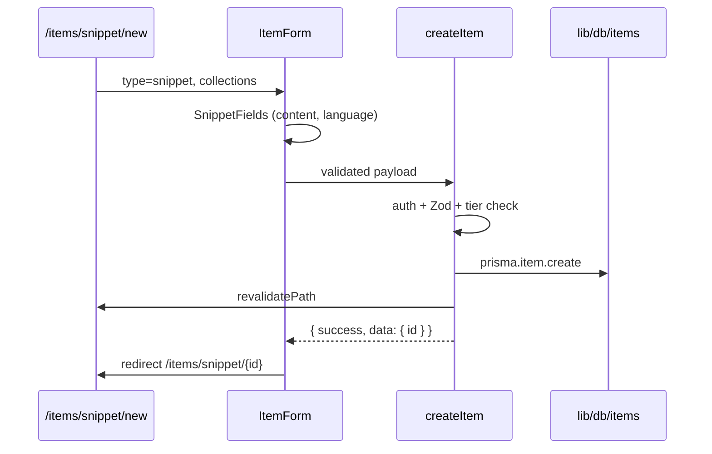
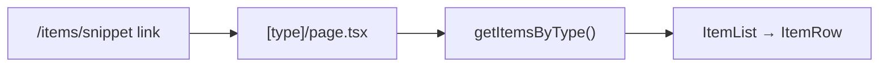

# Item CRUD Architecture

Design for a unified create/read/update/delete system across all 7 item types. This document reflects current codebase conventions and proposes the structure to implement next.

**Related**: [Item Types](./item-types.md)

---

## Current State

| Layer | Status |
|-------|--------|
| **Prisma models** | `Item`, `ItemType`, `Tag`, `ItemTag` defined in `prisma/schema.prisma` |
| **Read queries** | `src/lib/db/items.ts` — `getPinnedItems`, `getRecentItems`, `getSystemItemTypes`, `getUserItemStats` |
| **List UI** | `ItemRow` on dashboard (title, description, type styling, tags) |
| **Mutations** | None — no Server Actions, no item API routes |
| **Item pages** | None — sidebar links to `/items/{type}` and `ItemRow` links to `/items/{id}` but neither route exists |
| **Validation** | Zod referenced in coding standards but not yet installed |
| **Auth** | `getCurrentUser()` in `src/lib/db/user.ts`; proxy protects `/dashboard` and `/profile` only |

The dashboard "New Item" button in `top-bar.tsx` is disabled (display only).

---

## Design Principles

1. **One mutation surface** — all create/update/delete logic in a single actions file.
2. **Queries in `lib/db`** — server components call Prisma helpers directly; no fetch layer for reads.
3. **Type-specific UI in components** — actions accept a normalized payload; rendering and field layout vary by type in React components.
4. **Shared item model** — all types use the same `Item` table; `contentType` (`text` | `file`) drives storage shape (see [item-types.md](./item-types.md)).
5. **Auth on every mutation** — actions resolve the session user and scope all queries by `userId`.

---

## File Structure

```
src/
├── actions/
│   └── items.ts                 # createItem, updateItem, deleteItem, toggleFavorite, togglePinned
├── app/
│   └── items/
│       ├── layout.tsx           # DashboardShell + auth (same pattern as dashboard/profile)
│       └── [type]/
│           ├── page.tsx         # Filtered list for one type
│           ├── new/
│           │   └── page.tsx     # Create form
│           └── [id]/
│               └── page.tsx     # View / edit single item
├── app/api/
│   └── items/
│       └── upload/
│           └── route.ts         # File/image upload to R2 (not a Server Action)
├── components/
│   └── items/
│       ├── item-list.tsx        # Renders ItemRow[] with empty state
│       ├── item-form.tsx        # Client shell: common fields + type-specific slot
│       ├── item-form-actions.tsx # Submit / cancel / delete buttons
│       ├── item-type-fields/
│       │   ├── text-content-fields.tsx   # snippet, prompt, note, command
│       │   ├── snippet-fields.tsx        # language picker (wraps text-content)
│       │   ├── link-fields.tsx           # url input
│       │   └── file-fields.tsx           # upload UI for file + image
│       ├── item-detail/
│       │   ├── text-item-detail.tsx      # code block / markdown / copy
│       │   ├── link-item-detail.tsx      # external link preview
│       │   └── file-item-detail.tsx      # download / image preview
│       └── delete-item-dialog.tsx
├── lib/
│   ├── db/
│   │   └── items.ts             # Extend: getItemsByType, getItemById, create/update/delete helpers
│   ├── validations/
│   │   └── items.ts             # Zod schemas (add `zod` dependency)
│   └── items/
│       ├── content-type.ts      # type name → contentType mapping
│       └── type-registry.ts     # type name → field/detail component keys
└── types/
    └── items.ts                 # ItemDetail, ItemFormState, ActionResult
```

Existing files stay in place:

- `src/lib/item-type-styles.ts` — icons/colors (unchanged)
- `src/components/dashboard/item-row.tsx` — reused in item lists; update `href` (see Routing)

---

## Routing

### URL scheme

Use a **nested dynamic route** under `/items/[type]` so type slug and item ID never collide:

| URL | Purpose |
|-----|---------|
| `/items/snippet` | List all snippet items |
| `/items/prompt` | List all prompt items |
| `/items/link` | List all URL/link items |
| `/items/snippet/new` | Create a new snippet |
| `/items/snippet/{id}` | View or edit one snippet |

`[type]` is the lowercase `ItemType.name` (`snippet`, `prompt`, `command`, `note`, `file`, `image`, `link`). Matches sidebar links in `sidebar-content.tsx`.

### Route conflict to fix

`ItemRow` currently links to `/items/${item.id}`. A single `[param]` segment cannot serve both type slugs and CUIDs reliably. Update links to:

```
/items/{type.name}/{item.id}
```

Example: `/items/snippet/item-use-debounce`.

### Page responsibilities

| Page | Server component duties |
|------|-------------------------|
| `[type]/page.tsx` | Validate type slug → `notFound()` if invalid; `getItemsByType(userId, typeId)`; render `ItemList` |
| `[type]/new/page.tsx` | Load type metadata, collections for picker; render `ItemForm` in create mode |
| `[type]/[id]/page.tsx` | `getItemById(userId, id)` with type include; verify item type matches `[type]` param; render detail or `ItemForm` in edit mode |

### Layout and auth

- Add `src/app/items/layout.tsx` using `DashboardShell` + `getDashboardLayoutData()` (same as `dashboard/layout.tsx` and `profile/layout.tsx`).
- Extend `src/proxy.ts` matcher to include `/items` and `/items/:path*`.

### Reserved type slugs

`SYSTEM_ITEM_TYPE_ORDER` in `item-type-styles.ts` defines valid slugs. Reject unknown `[type]` values with `notFound()`.

---

## Data Layer (`lib/db`)

Extend `src/lib/db/items.ts` with query helpers. Keep `DashboardItem` for list views; add `ItemDetail` for full editor/detail pages.

### New types

```ts
export type ItemDetail = {
  id: string;
  title: string;
  description: string | null;
  contentType: "text" | "file";
  content: string | null;
  url: string | null;
  language: string | null;
  fileUrl: string | null;
  fileName: string | null;
  fileSize: number | null;
  isFavorite: boolean;
  isPinned: boolean;
  collectionId: string | null;
  type: CollectionItemType;
  tags: string[];
  createdAt: Date;
  updatedAt: Date;
};
```

### New functions

| Function | Purpose |
|----------|---------|
| `getItemTypeBySlug(slug)` | Resolve system/custom type by lowercase name |
| `getItemsByType(userId, typeId, options?)` | Paginated/filtered list for type page |
| `getItemById(userId, itemId)` | Single item with type + tags; `null` if not owned |
| `assertItemOwnership(userId, itemId)` | Throw or return false for actions |

Low-level Prisma create/update/delete can live in `lib/db/items.ts` (called by actions) or inline in actions — prefer **db helpers for testability** and to keep actions thin.

### Query patterns

Follow existing conventions:

- Use `cache()` for read helpers called multiple times per request (e.g. layout + page).
- Always filter by `userId`.
- Reuse `itemSelect` shape where possible; extend for detail fields (`content`, `url`, file fields).

---

## Mutations (`actions/items.ts`)

Single file with `"use server"` and the `{ success, data, error }` return pattern from coding standards.

### Actions

| Action | Input | Behavior |
|--------|-------|----------|
| `createItem` | Validated create payload | Resolve user, check tier limits, insert item + tags, `revalidatePath` |
| `updateItem` | `id` + partial payload | Ownership check, update item, sync tags |
| `deleteItem` | `id` | Ownership check, delete item (cascade tags), delete R2 object if file type |
| `toggleFavorite` | `id` | Flip `isFavorite` |
| `togglePinned` | `id` | Flip `isPinned` |

### What stays out of actions

- **Field rendering** — components only
- **Syntax highlighting, markdown preview** — components only
- **File binary upload** — `POST /api/items/upload` returns `{ fileUrl, fileName, fileSize }`; action receives metadata only

### Validation (Zod)

Add `zod` and define schemas in `src/lib/validations/items.ts`:

```ts
// Shared base
const baseItemSchema = z.object({
  title: z.string().min(1).max(200),
  description: z.string().max(2000).optional(),
  typeId: z.string().cuid(),
  collectionId: z.string().cuid().nullable().optional(),
  tags: z.array(z.string().min(1).max(50)).max(20).optional(),
  isFavorite: z.boolean().optional(),
  isPinned: z.boolean().optional(),
});

// Discriminate by contentType (derived from type, not sent by client)
const textPayloadSchema = baseItemSchema.extend({
  content: z.string().optional(),
  url: z.string().url().optional(),
  language: z.string().max(50).optional(),
});

const filePayloadSchema = baseItemSchema.extend({
  fileUrl: z.string().url(),
  fileName: z.string().min(1),
  fileSize: z.number().int().positive(),
});
```

Actions map `typeId` → type name → `contentType`, then pick the correct schema. Link type validates `url` is required; text types validate `content` as needed.

### Tier limits

From project overview:

- Free: 50 items, image uploads allowed, no generic file uploads
- Pro: unlimited items, file + image uploads, custom types

Enforce in `createItem`:

- Count user items before insert (free tier cap).
- Reject `file` type for non-Pro users (`isPro` on `DashboardUser`).
- `image` allowed on free tier per spec (sidebar PRO badge may reflect planned gating — align product decision at implementation time).

---

## Type-Specific Logic (Components, Not Actions)

### Registry pattern

`src/lib/items/type-registry.ts` maps type name to component keys:

```ts
export const ITEM_TYPE_FIELD_COMPONENTS = {
  snippet: "snippet",
  prompt: "text",
  command: "text",
  note: "text",
  link: "link",
  file: "file",
  image: "file",
} as const;
```

`ItemForm` (client component) reads the type name and renders the matching field component from `item-type-fields/`.

### Component responsibilities

| Component | Role |
|-----------|------|
| `item-form.tsx` | Common fields: title, description, collection select, tags, favorite/pin toggles. Delegates payload fields to type slot. Calls `createItem` / `updateItem`. |
| `text-content-fields.tsx` | Textarea (or code editor later) for `content` |
| `snippet-fields.tsx` | Language `<select>` + `text-content-fields` |
| `link-fields.tsx` | URL input with basic validation feedback |
| `file-fields.tsx` | Upload button → API route → sets `fileUrl` / `fileName` / `fileSize` in form state |
| `text-item-detail.tsx` | Read-only content with copy button; syntax highlight when `language` set |
| `link-item-detail.tsx` | Title, description, external link button |
| `file-item-detail.tsx` | Image `` or file download link |
| `delete-item-dialog.tsx` | Confirm delete → `deleteItem` action |
| `item-list.tsx` | Maps items to `ItemRow`, empty state per type |

### Display differences by type

| Type | Form fields | Detail view |
|------|-------------|-------------|
| snippet | `content`, `language` | Syntax-highlighted code block, copy |
| prompt | `content` | Plain/markdown text, copy |
| command | `content` | Monospace command, one-click copy |
| note | `content` | Markdown render (editor planned) |
| link | `url` | Open link, optional description |
| file | upload → file metadata | Download link |
| image | upload → file metadata | Image preview |

List views (`ItemRow`) stay type-agnostic — only icon/color from `ItemType` differ.

---

## File Upload Flow

Per coding standards, use an API route for uploads:

```
Client (file-fields.tsx)
  → POST /api/items/upload (multipart)
  → Validate session, file size/type
  → Upload to Cloudflare R2
  → Return { fileUrl, fileName, fileSize }

Client submits form
  → createItem / updateItem (metadata only)
```

Delete flow: `deleteItem` action removes DB row and triggers R2 object deletion when `fileUrl` is set.

---

## End-to-End Flows

### Create snippet



### List by type (sidebar click)



### Update / delete

- Edit mode on `[type]/[id]/page.tsx` toggles `ItemForm` vs detail components.
- `updateItem` revalidates `/items/[type]` and `/items/[type]/[id]`.
- `deleteItem` redirects to `/items/[type]` after success.

---

## Integration with Existing Dashboard

| Surface | Change |
|---------|--------|
| Sidebar type links | Already `/items/{type}` — implement `[type]/page.tsx` |
| `ItemRow` href | Change to `/items/{type.name}/{id}` |
| Top bar "New Item" | Open type picker → navigate to `/items/{type}/new` |
| Dashboard pinned/recent | No change; links go to new detail route |
| Profile stats | No change |
| Collections | `/collections/{id}` is separate; collection filter on item form optional |

---

## Implementation Order

1. Add `zod`; create validation schemas and `ItemDetail` types.
2. Extend `lib/db/items.ts` with `getItemTypeBySlug`, `getItemsByType`, `getItemById`.
3. Create `items/layout.tsx`; update proxy matcher.
4. Implement `[type]/page.tsx` (list only) — unblocks sidebar links.
5. Implement `actions/items.ts` with `createItem`, `updateItem`, `deleteItem`.
6. Build `ItemForm` + type field components; `[type]/new` and `[type]/[id]` pages.
7. Fix `ItemRow` href; enable "New Item" in top bar.
8. Add `/api/items/upload` when implementing file/image types.
9. Add `toggleFavorite` / `togglePinned` (inline on detail or row actions).

---

## Sources

- `context/coding-standards.md` — Server Actions, lib/db, Zod, API routes for uploads
- `context/project-overview.md` — MVP CRUD, tier limits, full-screen editor
- `context/features/dashboard-phase-2-spec.md` — `/items/TYPE` sidebar links
- `docs/item-types.md` — per-type fields and content classification
- `prisma/schema.prisma` — `Item`, `ItemType` models
- `src/lib/db/items.ts` — existing read patterns
- `src/lib/db/user.ts` — `getCurrentUser()` auth helper
- `src/components/dashboard/sidebar-content.tsx` — type navigation
- `src/components/dashboard/item-row.tsx` — list row (href needs update)
