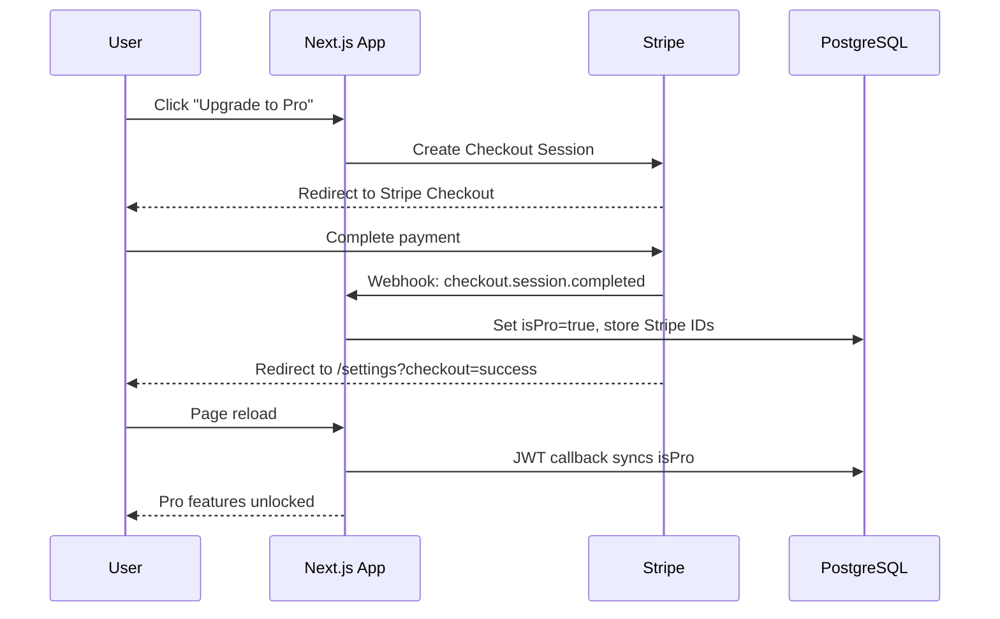

# Stripe Integration Plan — Memex Pro

> Research date: 2026-08-08  
> Pricing: **$8/mo** monthly, **$72/yr** annual  
> Product name in codebase: **Memex Pro** (research prompt referenced "DevStash Pro")

---

## 1. Current State Analysis

### 1.1 User Model (Prisma)

The `User` model already includes subscription fields:

```prisma
model User {
  id                   String    @id @default(cuid())
  email                String    @unique
  isPro                Boolean   @default(false)
  stripeCustomerId     String?
  stripeSubscriptionId String?
  // ...
}
```

**Gaps:** No `stripePriceId`, `subscriptionStatus`, or `currentPeriodEnd` fields. For MVP, `isPro` plus the two Stripe IDs are sufficient. Consider adding `subscriptionStatus` later for grace-period handling on failed payments.

### 1.2 NextAuth Configuration

**File:** `src/auth.ts`

- Strategy: **JWT** (not database sessions)
- Adapter: `PrismaAdapter` (still used for account linking)
- Providers: GitHub OAuth + Credentials (email/password)
- JWT callback sets `token.sub`, `name`, `email`, `picture` on sign-in only
- Session callback maps token fields to `session.user`
- **`isPro` is NOT in the JWT or session** — only `id` is extended via `src/types/next-auth.d.ts`

```typescript
// src/types/next-auth.d.ts — current
interface Session {
  user: {
    id: string;
  } & DefaultSession["user"];
}
```

### 1.3 How User Data Is Accessed

| Layer | Pattern | `isPro` source |
|-------|---------|----------------|
| Server layouts | `getCurrentUser()` from `src/lib/db/user.ts` | Fresh DB query (cached per request via React `cache`) |
| Server actions | `auth()` + `getUserIsPro(userId)` | DB query |
| API routes | `auth()` + `getUserIsPro(userId)` | DB query |
| Client components | `isPro` passed as prop from server layouts | Prop-drilled from `getCurrentUser()` |

**Layouts passing `isPro`:** `dashboard`, `items`, `collections`, `favorites`, `profile`, `settings` — all call `getCurrentUser()` and pass `isPro` to `DashboardShell`.

**Implication:** Server-rendered pages already reflect webhook-updated `isPro` on navigation/refresh. Client-only `useSession()` would be stale until JWT sync is added.

### 1.4 Existing Payment / Subscription Code

| Area | Status |
|------|--------|
| `stripe` npm package | **Not installed** |
| Stripe API routes | **None** |
| Webhook handler | **None** |
| Billing UI | **None** (settings has account + editor prefs only) |
| Env vars in `.env.example` | **Already defined** (see §3.3) |
| Pro file upload gating | **Implemented** |
| Free tier limits (50 items / 3 collections) | **Not enforced** |
| Custom item types | **Schema ready**, UI not built |
| AI features | **Not implemented** |
| Export | **Not implemented** |

### 1.5 Pro Gating Already Implemented

**Server-side (authoritative):**

- `src/actions/items.ts` — blocks `type === "file"` for non-Pro users
- `src/app/api/items/upload/route.ts` — blocks `category === "file"` for non-Pro (images allowed on free tier)

**Client-side (UX only):**

- `src/components/items/item-create-dialog.tsx` — disables file/image types in type selector
- `src/lib/validations/items.ts` — `resolveDefaultCreateType()` falls back to `snippet` for file/image
- `src/components/dashboard/sidebar-content.tsx` — shows Pro badge on file/image nav items

**Note:** Project spec says free tier gets "image uploads" but file uploads are Pro-only. Current code matches this.

---

## 2. Feature Gating Analysis

### 2.1 Free Tier Limits (from project spec)

| Resource | Free limit | Pro limit |
|----------|-----------|-----------|
| Items | 50 | Unlimited |
| Collections | 3 | Unlimited |
| File uploads | No | Yes |
| Image uploads | Yes | Yes |
| Custom item types | No | Yes (planned) |
| AI features | No | Yes (planned) |
| Export (JSON/ZIP) | No | Yes (planned) |

Constants to add in `src/lib/subscription-limits.ts`:

```typescript
export const FREE_ITEM_LIMIT = 50;
export const FREE_COLLECTION_LIMIT = 3;
```

### 2.2 Where Limits Should Be Enforced

| Location | Check needed |
|----------|-------------|
| `src/actions/items.ts` → `createItem` | Count user items; reject if `!isPro && count >= 50` |
| `src/actions/collections.ts` → `createCollection` | Count user collections; reject if `!isPro && count >= 3` |
| `src/components/items/item-create-dialog.tsx` | Show upgrade prompt when at item limit |
| `src/components/collections/collection-create-dialog.tsx` | Show upgrade prompt when at collection limit |
| `src/components/profile/usage-statistics-card.tsx` | Show `X / 50` and `X / 3` for free users |
| `src/lib/db/items.ts` → `getUserItemStats` | Already returns `itemCount` and `collectionCount` — reuse |

**No existing limit checks** in `createCollection` or `createItem` beyond file-type Pro gating.

### 2.3 Pro-Only Features (current + planned)

| Feature | Gate location (when built) |
|---------|---------------------------|
| File uploads | `items.ts`, `upload/route.ts`, `item-create-dialog.tsx` (done) |
| Custom item types | `actions/item-types.ts` (future), sidebar type management |
| AI tagging/summaries | `actions/ai.ts` (future) |
| Export | `api/export/route.ts` (future) |

### 2.4 Settings Page Structure

**Current:** `src/app/settings/page.tsx`

```
Settings
├── EditorPreferencesCard
└── AccountActionsCard (password, delete account)
```

**Add:** `BillingCard` between or after existing cards with:

- Current plan badge (Free / Pro)
- Usage summary (items, collections) for free users
- "Upgrade to Pro" button → Stripe Checkout
- "Manage subscription" button → Stripe Customer Portal (Pro users)
- Billing period display (monthly/yearly) for Pro users

### 2.5 Marketing / Upgrade Entry Points

| Location | Current behavior | Target behavior |
|----------|-----------------|-----------------|
| `src/components/marketing/homepage-pricing.tsx` | Pro CTA → `/register` | Logged-out → `/register`; logged-in → checkout |
| `src/components/dashboard/sidebar-user-menu.tsx` | Shows "(Pro)" suffix | Add "Upgrade" menu item for free users |
| Profile usage card | Shows counts only | Show limits + upgrade CTA for free users |

---

## 3. API & Webhook Patterns

### 3.1 Existing API Route Conventions

- Location: `src/app/api/[feature]/route.ts`
- Auth: `const session = await auth()` → 401 if missing
- Errors: `NextResponse.json({ error: "..." }, { status })`
- Rate limiting on auth routes via `@/lib/rate-limit`
- JSON body parsing with try/catch → 400 on invalid JSON

**Webhook route is an exception:** No session auth; uses Stripe signature verification instead. Must use raw body (not parsed JSON) for signature check.

### 3.2 Server Action Error Handling

```typescript
type ActionResult<T> =
  | { success: true; data: T }
  | { success: false; error: string };
```

- Always validate with Zod first
- Return user-friendly error strings (displayed via `toast.error`)
- Use `revalidatePath()` after mutations

### 3.3 Environment Variables

Already declared in `.env.example`:

- `STRIPE_SECRET_KEY` — server-side Stripe API key
- `STRIPE_PUBLISHABLE_KEY` — only needed for Stripe.js client-side (not required for Checkout redirect)
- `STRIPE_WEBHOOK_SECRET` — webhook signing secret from Stripe Dashboard or CLI
- `STRIPE_PRICE_ID_MONTHLY` — Price ID for $8/mo plan
- `STRIPE_PRICE_ID_YEARLY` — Price ID for $72/yr plan

Follow the `src/lib/r2/client.ts` pattern with a `getRequiredEnv()` helper:

```typescript
// src/lib/stripe/client.ts
import Stripe from "stripe";

function getRequiredEnv(name: string): string {
  const value = process.env[name];
  if (!value) throw new Error(`Missing required environment variable: ${name}`);
  return value;
}

let stripeInstance: Stripe | null = null;

export function getStripe(): Stripe {
  if (!stripeInstance) {
    stripeInstance = new Stripe(getRequiredEnv("STRIPE_SECRET_KEY"), {
      apiVersion: "2025-04-30.basil", // pin to latest stable at install time
      typescript: true,
    });
  }
  return stripeInstance;
}

export function getStripePriceId(period: "monthly" | "yearly"): string {
  return period === "yearly"
    ? getRequiredEnv("STRIPE_PRICE_ID_YEARLY")
    : getRequiredEnv("STRIPE_PRICE_ID_MONTHLY");
}
```

---

## 4. Implementation Plan

### 4.1 Architecture Overview



### 4.2 Files to Create

#### `src/lib/stripe/client.ts`

Stripe singleton + env helpers (see §3.3).

#### `src/lib/stripe/subscription.ts`

```typescript
import { prisma } from "@/lib/prisma";
import { getAppUrl } from "@/lib/app-url";
import { getStripe, getStripePriceId } from "./client";

export async function getOrCreateStripeCustomer(
  userId: string,
  email: string,
): Promise<string> {
  const user = await prisma.user.findUnique({
    where: { id: userId },
    select: { stripeCustomerId: true },
  });

  if (user?.stripeCustomerId) return user.stripeCustomerId;

  const customer = await getStripe().customers.create({
    email,
    metadata: { userId },
  });

  await prisma.user.update({
    where: { id: userId },
    data: { stripeCustomerId: customer.id },
  });

  return customer.id;
}

export async function createCheckoutSession(
  userId: string,
  email: string,
  period: "monthly" | "yearly",
): Promise<string> {
  const customerId = await getOrCreateStripeCustomer(userId, email);
  const appUrl = getAppUrl();

  const session = await getStripe().checkout.sessions.create({
    customer: customerId,
    mode: "subscription",
    line_items: [{ price: getStripePriceId(period), quantity: 1 }],
    success_url: `${appUrl}/settings?checkout=success`,
    cancel_url: `${appUrl}/settings?checkout=cancelled`,
    metadata: { userId },
    subscription_data: { metadata: { userId } },
  });

  if (!session.url) throw new Error("Failed to create checkout session");
  return session.url;
}

export async function createPortalSession(
  stripeCustomerId: string,
): Promise<string> {
  const appUrl = getAppUrl();
  const session = await getStripe().billingPortal.sessions.create({
    customer: stripeCustomerId,
    return_url: `${appUrl}/settings`,
  });
  return session.url;
}
```

#### `src/lib/stripe/webhook-handlers.ts`

```typescript
import type Stripe from "stripe";
import { prisma } from "@/lib/prisma";

export async function handleCheckoutCompleted(
  session: Stripe.Checkout.Session,
): Promise<void> {
  const userId = session.metadata?.userId;
  const customerId = session.customer as string;
  const subscriptionId = session.subscription as string;

  if (!userId) return;

  await prisma.user.update({
    where: { id: userId },
    data: {
      isPro: true,
      stripeCustomerId: customerId,
      stripeSubscriptionId: subscriptionId,
    },
  });
}

export async function handleSubscriptionUpdated(
  subscription: Stripe.Subscription,
): Promise<void> {
  const userId = subscription.metadata?.userId;
  if (!userId) return;

  const isActive = ["active", "trialing"].includes(subscription.status);

  await prisma.user.update({
    where: { id: userId },
    data: {
      isPro: isActive,
      stripeSubscriptionId: subscription.id,
    },
  });
}

export async function handleSubscriptionDeleted(
  subscription: Stripe.Subscription,
): Promise<void> {
  const userId = subscription.metadata?.userId;
  if (!userId) return;

  await prisma.user.update({
    where: { id: userId },
    data: {
      isPro: false,
      stripeSubscriptionId: null,
    },
  });
}
```

#### `src/lib/subscription-limits.ts`

```typescript
export const FREE_ITEM_LIMIT = 50;
export const FREE_COLLECTION_LIMIT = 3;

export function isAtItemLimit(count: number, isPro: boolean): boolean {
  return !isPro && count >= FREE_ITEM_LIMIT;
}

export function isAtCollectionLimit(count: number, isPro: boolean): boolean {
  return !isPro && count >= FREE_COLLECTION_LIMIT;
}
```

#### `src/app/api/stripe/checkout/route.ts`

```typescript
import { NextResponse } from "next/server";
import { z } from "zod";

import { auth } from "@/auth";
import { createCheckoutSession } from "@/lib/stripe/subscription";

const bodySchema = z.object({
  period: z.enum(["monthly", "yearly"]),
});

export async function POST(request: Request) {
  const session = await auth();
  if (!session?.user?.id || !session.user.email) {
    return NextResponse.json({ error: "Unauthorized" }, { status: 401 });
  }

  let body: unknown;
  try {
    body = await request.json();
  } catch {
    return NextResponse.json({ error: "Invalid JSON body" }, { status: 400 });
  }

  const parsed = bodySchema.safeParse(body);
  if (!parsed.success) {
    return NextResponse.json({ error: "Invalid billing period" }, { status: 400 });
  }

  try {
    const url = await createCheckoutSession(
      session.user.id,
      session.user.email,
      parsed.data.period,
    );
    return NextResponse.json({ url });
  } catch {
    return NextResponse.json({ error: "Checkout failed" }, { status: 500 });
  }
}
```

#### `src/app/api/stripe/portal/route.ts`

```typescript
import { NextResponse } from "next/server";

import { auth } from "@/auth";
import { prisma } from "@/lib/prisma";
import { createPortalSession } from "@/lib/stripe/subscription";

export async function POST() {
  const session = await auth();
  if (!session?.user?.id) {
    return NextResponse.json({ error: "Unauthorized" }, { status: 401 });
  }

  const user = await prisma.user.findUnique({
    where: { id: session.user.id },
    select: { stripeCustomerId: true },
  });

  if (!user?.stripeCustomerId) {
    return NextResponse.json({ error: "No subscription found" }, { status: 400 });
  }

  try {
    const url = await createPortalSession(user.stripeCustomerId);
    return NextResponse.json({ url });
  } catch {
    return NextResponse.json({ error: "Portal session failed" }, { status: 500 });
  }
}
```

#### `src/app/api/stripe/webhook/route.ts`

```typescript
import { NextResponse } from "next/server";
import type Stripe from "stripe";

import { getStripe } from "@/lib/stripe/client";
import {
  handleCheckoutCompleted,
  handleSubscriptionDeleted,
  handleSubscriptionUpdated,
} from "@/lib/stripe/webhook-handlers";

export async function POST(request: Request) {
  const body = await request.text();
  const signature = request.headers.get("stripe-signature");

  if (!signature) {
    return NextResponse.json({ error: "Missing signature" }, { status: 400 });
  }

  const webhookSecret = process.env.STRIPE_WEBHOOK_SECRET;
  if (!webhookSecret) {
    return NextResponse.json({ error: "Webhook not configured" }, { status: 500 });
  }

  let event: Stripe.Event;
  try {
    event = getStripe().webhooks.constructEvent(body, signature, webhookSecret);
  } catch {
    return NextResponse.json({ error: "Invalid signature" }, { status: 400 });
  }

  switch (event.type) {
    case "checkout.session.completed":
      await handleCheckoutCompleted(event.data.object as Stripe.Checkout.Session);
      break;
    case "customer.subscription.updated":
      await handleSubscriptionUpdated(event.data.object as Stripe.Subscription);
      break;
    case "customer.subscription.deleted":
      await handleSubscriptionDeleted(event.data.object as Stripe.Subscription);
      break;
  }

  return NextResponse.json({ received: true });
}
```

> **Next.js note:** `request.text()` provides the raw body needed for signature verification. Add `export const runtime = "nodejs"` if the Stripe SDK requires Node.js runtime.

#### `src/components/settings/billing-card.tsx`

Client component with:

- Plan status display (Free / Pro)
- Monthly/yearly toggle for upgrade
- `fetch("/api/stripe/checkout", { method: "POST", body: JSON.stringify({ period }) })` → redirect to returned URL
- Manage subscription button for Pro users → portal API
- Toast on `?checkout=success` / `?checkout=cancelled` query params

#### `src/components/shared/upgrade-prompt.tsx`

Reusable dialog/banner for limit-hit scenarios:

```typescript
type UpgradePromptProps = {
  open: boolean;
  onOpenChange: (open: boolean) => void;
  reason: "item_limit" | "collection_limit" | "file_upload" | "general";
};
```

#### Tests

- `src/lib/subscription-limits.test.ts` — limit helper unit tests
- `src/lib/stripe/webhook-handlers.test.ts` — mock Prisma, verify DB updates per event

---

### 4.3 Files to Modify

#### `package.json`

```bash
npm install stripe
```

#### `src/auth.ts` — JWT session sync

Add `isPro` to JWT and session per research workaround:

```typescript
// In jwt callback, after setting token.sub:
if (token.sub) {
  const dbUser = await prisma.user.findUnique({
    where: { id: token.sub },
    select: { isPro: true },
  });
  token.isPro = dbUser?.isPro ?? false;
}

// In session callback:
if (session.user && token.sub) {
  session.user.isPro = (token.isPro as boolean) ?? false;
}
```

#### `src/types/next-auth.d.ts`

```typescript
declare module "next-auth" {
  interface Session {
    user: {
      id: string;
      isPro: boolean;
    } & DefaultSession["user"];
  }
}

declare module "next-auth/jwt" {
  interface JWT {
    isPro?: boolean;
  }
}
```

#### `src/actions/items.ts`

Add item count check before creation:

```typescript
import { FREE_ITEM_LIMIT } from "@/lib/subscription-limits";
import { getUserItemStats } from "@/lib/db/items";

// Inside createItem, after auth check:
const isPro = await getUserIsPro(session.user.id);

if (!isPro) {
  const stats = await getUserItemStats(session.user.id);
  if (stats.itemCount >= FREE_ITEM_LIMIT) {
    return {
      success: false,
      error: `Free plan is limited to ${FREE_ITEM_LIMIT} items. Upgrade to Pro for unlimited items.`,
    };
  }
}

// Existing file-type Pro check can reuse the isPro variable above
```

#### `src/actions/collections.ts`

```typescript
import { FREE_COLLECTION_LIMIT } from "@/lib/subscription-limits";
import { getUserIsPro } from "@/lib/db/user";
import { getUserItemStats } from "@/lib/db/items";

// Inside createCollection, after auth check:
const isPro = await getUserIsPro(session.user.id);
if (!isPro) {
  const stats = await getUserItemStats(session.user.id);
  if (stats.collectionCount >= FREE_COLLECTION_LIMIT) {
    return {
      success: false,
      error: `Free plan is limited to ${FREE_COLLECTION_LIMIT} collections. Upgrade to Pro for unlimited collections.`,
    };
  }
}
```

#### `src/lib/db/settings.ts`

Extend `SettingsData` with billing info:

```typescript
export type SettingsData = {
  user: {
    email: string;
    hasPassword: boolean;
    isPro: boolean;
    stripeCustomerId: string | null;
  };
  usage: {
    itemCount: number;
    collectionCount: number;
  };
  editorPreferences: EditorPreferences;
};
```

#### `src/app/settings/page.tsx`

Add `<BillingCard />` with billing data props.

#### `src/components/profile/usage-statistics-card.tsx`

Accept optional `isPro` prop; show `count / limit` for free users.

#### `src/app/profile/page.tsx`

Pass `isPro` to usage card.

#### `src/components/marketing/homepage-pricing.tsx`

Pro CTA: check auth state; if logged in, trigger checkout instead of `/register`.

#### `src/app/api/auth/account/route.ts` (DELETE)

Before deleting user, cancel active Stripe subscription if `stripeSubscriptionId` is set.

#### `src/components/items/item-create-dialog.tsx` and `collection-create-dialog.tsx`

Accept count props; disable create button and show upgrade prompt at limits.

#### `src/components/dashboard/sidebar-user-menu.tsx`

Add "Upgrade to Pro" menu item when `!user.isPro`.

---

### 4.4 Stripe Dashboard Setup

1. **Create Stripe account** (or use existing test account)

2. **Create product**
   - Name: `Memex Pro`
   - Description: `Unlimited items, collections, file uploads, AI features, and export`

3. **Create prices**
   - Monthly: `$8.00 USD` / month → copy Price ID to `STRIPE_PRICE_ID_MONTHLY`
   - Yearly: `$72.00 USD` / year → copy Price ID to `STRIPE_PRICE_ID_YEARLY`

4. **Configure Customer Portal** (Settings → Billing → Customer portal)
   - Enable: cancel subscription, switch plans, update payment method
   - Set redirect URL to production domain `/settings`

5. **Create webhook endpoint**
   - URL: `https://<domain>/api/stripe/webhook`
   - Events to listen for:
     - `checkout.session.completed`
     - `customer.subscription.updated`
     - `customer.subscription.deleted`
   - Copy signing secret to `STRIPE_WEBHOOK_SECRET`

6. **Local development**
   ```bash
   stripe listen --forward-to localhost:3000/api/stripe/webhook
   ```
   Use the CLI-generated webhook secret for local `.env`.

7. **API keys**
   - Test mode secret key → `STRIPE_SECRET_KEY`
   - Test mode publishable key → `STRIPE_PUBLISHABLE_KEY` (only if using Stripe.js)

---

### 4.5 Testing Checklist

#### Unit Tests

- [ ] `isAtItemLimit` / `isAtCollectionLimit` return correct values
- [ ] Webhook handlers update `isPro`, `stripeCustomerId`, `stripeSubscriptionId` correctly
- [ ] Webhook handlers handle missing `userId` metadata gracefully
- [ ] `createItem` rejects at 50 items for free user
- [ ] `createCollection` rejects at 3 collections for free user
- [ ] Existing file upload Pro gating still works

#### Integration (Stripe Test Mode)

- [ ] Checkout session creates successfully for monthly plan
- [ ] Checkout session creates successfully for yearly plan
- [ ] Successful checkout sets `isPro = true` in database
- [ ] Page reload after checkout shows Pro badge in sidebar
- [ ] File upload works after upgrade
- [ ] Customer portal opens for Pro user
- [ ] Subscription cancellation via portal sets `isPro = false`
- [ ] `customer.subscription.updated` with `past_due` status handled
- [ ] Account deletion cancels Stripe subscription
- [ ] Webhook rejects requests with invalid signature
- [ ] Idempotent webhook handling (duplicate events do not cause errors)

#### Manual UX

- [ ] Free user sees usage limits on profile page
- [ ] Free user sees upgrade CTA in settings
- [ ] Free user hitting item limit sees friendly error + upgrade prompt
- [ ] Free user hitting collection limit sees friendly error + upgrade prompt
- [ ] Homepage pricing CTA works for logged-in users
- [ ] `?checkout=success` shows success toast on settings page
- [ ] `?checkout=cancelled` shows cancelled toast

#### Edge Cases

- [ ] User with existing `stripeCustomerId` can re-subscribe after cancellation
- [ ] GitHub OAuth user (no password) can complete checkout
- [ ] User cannot create checkout session while already Pro (return error or redirect to portal)
- [ ] Stripe CLI webhook forwarding works in local dev

---

### 4.6 Implementation Order

| Phase | Task | Depends on |
|-------|------|-----------|
| **1** | Install `stripe` package | — |
| **1** | Create `src/lib/stripe/client.ts` | Env vars |
| **1** | Create `src/lib/subscription-limits.ts` + tests | — |
| **2** | Create `src/lib/stripe/subscription.ts` | Phase 1 |
| **2** | Create checkout + portal API routes | Phase 2 |
| **2** | Create webhook route + handlers | Phase 2 |
| **3** | Update `src/auth.ts` JWT sync for `isPro` | — |
| **3** | Update `src/types/next-auth.d.ts` | Phase 3 |
| **4** | Add limit enforcement to `items.ts` + `collections.ts` actions | Phase 1 |
| **4** | Add action tests for limits | Phase 4 |
| **5** | Create `BillingCard` + update settings page | Phase 2 |
| **5** | Create `UpgradePrompt` component | Phase 5 |
| **5** | Update create dialogs with limit UX | Phase 4, 5 |
| **6** | Update profile usage card with limits | Phase 1 |
| **6** | Update sidebar user menu + homepage pricing CTAs | Phase 5 |
| **7** | Handle subscription cancel on account delete | Phase 2 |
| **8** | Stripe Dashboard setup (test mode) | Phase 2 |
| **9** | End-to-end testing with Stripe CLI | All |

**Recommended first PR:** Phases 1–4 (backend + limits, no UI)  
**Second PR:** Phases 5–7 (billing UI + upgrade flows)  
**Third PR:** Phase 9 hardening + production Stripe config

---

## 5. Key Decisions & Notes

### Session sync strategy

The research prompt documents a known NextAuth v5 limitation: `trigger === "update"` does not reliably refresh `isPro` after webhook updates. The recommended fix is to **always sync `isPro` from the database in the JWT callback** (one small query per session validation). Combined with the existing `getCurrentUser()` DB fetch in layouts, this gives consistent Pro status across server and client.

A page reload after Stripe Checkout redirect is sufficient for the user to see Pro status.

### Webhook vs. Checkout success redirect

Do **not** set `isPro` in the success redirect handler. Always rely on webhooks as the source of truth. The success page should show a toast and let the JWT sync pick up the change (webhook may arrive slightly before or after redirect).

### Pricing discrepancy

Homepage free plan lists "All item types" but file/image types are Pro-gated in the app. Consider updating marketing copy to "Image uploads" instead of "All item types" for accuracy.

### Future: subscription status field

For production hardening, add `subscriptionStatus String?` to the User model to handle `past_due`, `unpaid`, and grace periods without immediately revoking access.

### Future: Stripe Tax

Not in scope for MVP. Add Stripe Tax later if selling to EU customers.

---

## 6. Summary

The codebase is well-prepared for Stripe integration: the Prisma schema, env vars, and `isPro` gating patterns are in place. The main work is:

1. **Stripe SDK + API routes** (checkout, portal, webhook)
2. **Free tier limit enforcement** (50 items, 3 collections) — currently missing
3. **Billing UI** in settings + upgrade prompts
4. **JWT `isPro` sync** for client session consistency
5. **Stripe Dashboard** product/price/webhook configuration

No schema migration is required for MVP — existing `isPro`, `stripeCustomerId`, and `stripeSubscriptionId` fields are sufficient.
